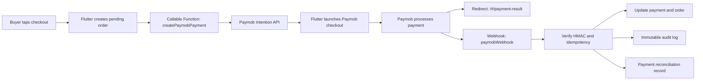

# Paymob Integration

## Current Implementation

Olmeg Connect now uses Paymob as the active checkout provider.

- Flutter creates the order first, then calls the `createPaymobPayment` Cloud Function.
- The Cloud Function creates a Paymob payment intention from the server using the Create Intention API.
- Paymob secret credentials are never stored in Flutter.
- Flutter receives only the Paymob `clientSecret`, public key, checkout URL, and local payment ID.
- Flutter calls Paymob's bridge channel `paymob_sdk_flutter` with method `payWithPaymob`.
- Android and iOS are prepared for the Paymob native SDK through the official Flutter bridge contract.
- Until the Paymob Android SDK AAR is placed in `android/app/libs`, the app falls back to hosted Paymob checkout.
- Paymob webhooks update `payments/{orderId}` and `orders/{orderId}` after HMAC verification.
- Payment reconciliation state is mirrored to `payment_reconciliations/{orderId}` for admin review.
- Client writes to `payments` are blocked in Firestore Rules. Payment status is backend-only.

## Required Paymob Values

Get these from the Paymob dashboard:

- API Secret Key
- Public Key
- HMAC Secret
- Integration ID or IDs for enabled payment methods
- Webhook callback URL
- Redirect URL

For Egypt, the default base URL is:

```text
https://accept.paymob.com
```

## Paymob Wizard Configuration

Use the Paymob Integration Onboarding Planner at:

```text
https://wizard.paymob.com/
```

Choose these options for Olmeg Connect:

- Role: Developer / Technical Integrator
- Operating country: Egypt
- Preferred integration path: Custom Website / API
- Development platform: Mobile Application
- Backend technology: Node.js
- Checkout experience: Unified Checkout (Redirect)
- Mobile platform: Flutter
- Advanced features: Callbacks & HMAC
- Advanced features: Manage Payments (Refund/Void/Capture)
- Optional later: Pay with Saved Cards
- Optional later: Digital Wallets, only after card checkout is stable

The wizard should produce the same implementation path we are using:

- Backend creates a Paymob intention.
- Flutter launches checkout using `publicKey` and `clientSecret`.
- Paymob webhook confirms final payment status.
- Firestore payment/order state is updated by backend only.

## Firebase Functions Configuration

Use either environment variables in your deployment pipeline or Firebase Functions config.

Recommended Firebase config:

```powershell
firebase functions:config:set `
  paymob.public_key="YOUR_PUBLIC_KEY" `
  paymob.secret_key="YOUR_SECRET_KEY" `
  paymob.hmac_secret="YOUR_HMAC_SECRET" `
  paymob.integration_ids="123456" `
  paymob.webhook_url="https://us-central1-olmeg-connect.cloudfunctions.net/paymobWebhook" `
  paymob.redirect_url="https://olmeg-connect.web.app/#/payment-result"
```

Deploy:

```powershell
firebase deploy --only functions:createPaymobPayment,functions:paymobWebhook,firestore:rules
```

If using environment variables instead, set:

```text
PAYMOB_BASE_URL=https://accept.paymob.com
PAYMOB_PUBLIC_KEY=...
PAYMOB_SECRET_KEY=...
PAYMOB_HMAC_SECRET=...
PAYMOB_INTEGRATION_IDS=123456
PAYMOB_WEBHOOK_URL=https://us-central1-olmeg-connect.cloudfunctions.net/paymobWebhook
PAYMOB_REDIRECT_URL=https://olmeg-connect.web.app/#/payment-result
```

## Android SDK Setup

The project follows the Paymob Flutter SDK bridge shape. The Flutter side calls:

```dart
MethodChannel('paymob_sdk_flutter').invokeMethod('payWithPaymob', {
  'publicKey': publicKey,
  'clientSecret': clientSecret,
  'appName': 'Olmeg Connect',
  'saveCardDefault': false,
  'showSaveCard': true,
});
```

The project has an Android bridge placeholder in:

```text
android/app/src/main/kotlin/com/example/olmeg_connect/MainActivity.kt
ios/Runner/AppDelegate.swift
```

The Android Gradle setup now includes:

- a built APK minimum SDK of `24`, which satisfies Paymob's minimum SDK `23` requirement
- `buildFeatures { dataBinding true }`
- JitPack repository
- local SDK repository at `android/libs`
- local app SDK artifacts from `android/app/libs`

Place Paymob SDK artifacts in the folder required by the downloaded SDK package. The repo currently keeps both supported locations ready:

```text
android/libs
android/app/libs
```

Next native step after getting the SDK package from Paymob:

1. Add the Paymob Android SDK `.aar` or `.jar` into the SDK folder required by the downloaded package.
2. Add the exact dependency, for example `implementation("com.paymob.sdk:Paymob-SDK:<downloaded-version>")`.
3. Replace the `paymob_sdk_missing` placeholder in `MainActivity.kt` with the real `PaymobSdk.Builder(...).build().start()` call.
4. Keep SDK success/failure callbacks as UI-only signals. The webhook remains the source of truth.

## iOS SDK Setup

The iOS bridge placeholder is registered in `ios/Runner/AppDelegate.swift` on the same channel and method:

```text
paymob_sdk_flutter
payWithPaymob
```

After adding Paymob's iOS SDK package, replace the placeholder with Paymob's `presentPayVC` flow and delegate callbacks. Keep accepted/rejected/pending callbacks as UI feedback only; the backend webhook still updates final payment state.

## Flutter SDK Notes

Per Paymob's Flutter SDK guide:

- The Flutter SDK is a bridge to native Android and iOS SDKs.
- Required inputs are `publicKey` and `clientSecret`.
- Optional customization includes `appName`, button colors, `saveCardDefault`, and `showSaveCard`.
- The app passes `appName`, green button background, white button text, `saveCardDefault: false`, and `showSaveCard: true`.
- Android requires minimum SDK 23 and compile SDK 33 or newer.
- Configure the Paymob integration response callback URL to the region endpoint, for Egypt:

```text
https://accept.paymob.com/api/acceptance/post_pay
```

## Payment Flow



## Create Intention Payload

`createPaymobPayment` sends Paymob:

- `amount` in cents
- `currency`, currently defaulting to `EGP`
- `payment_methods`, from `PAYMOB_INTEGRATION_IDS`
- `billing_data`, built from the buyer user document and order shipping snapshot
- `items`, built from the order item snapshots
- `special_reference`, set to the local `orderId`
- `extras.merchant_intention_id`, also set to the local `orderId`
- optional `notification_url` and `redirection_url` from config

The function accepts either `client_secret`, `cs`, or `clientSecret` in the Paymob response and normalizes it before returning data to Flutter.

## Security Rules

`payments` are now read-only for the buyer or admins from the client side. Creates, updates, and deletes are backend-only.

`paymob_webhooks` is protected from client writes and only admin-readable.

`payment_reconciliations` is protected from client writes and only admin-readable.

## Remaining Production Work

- Add the actual Paymob Android SDK binary and native launch code.
- Confirm the exact Paymob dashboard integration IDs and enabled methods.
- Configure webhook URL in Paymob dashboard.
- Test sandbox success, failed, cancelled, and duplicate webhook delivery.
- Add refund/void operations through backend functions only.
